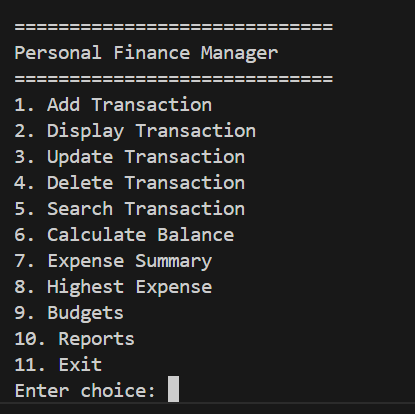
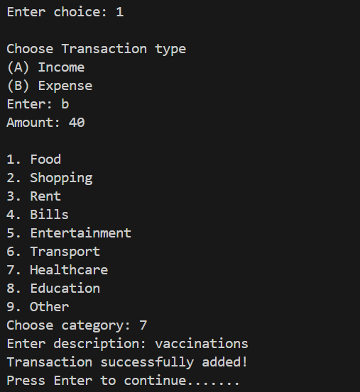
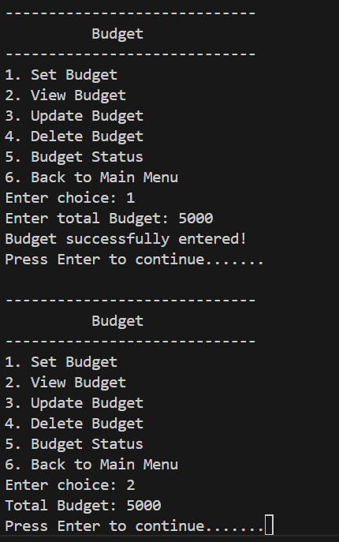
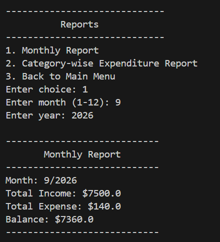
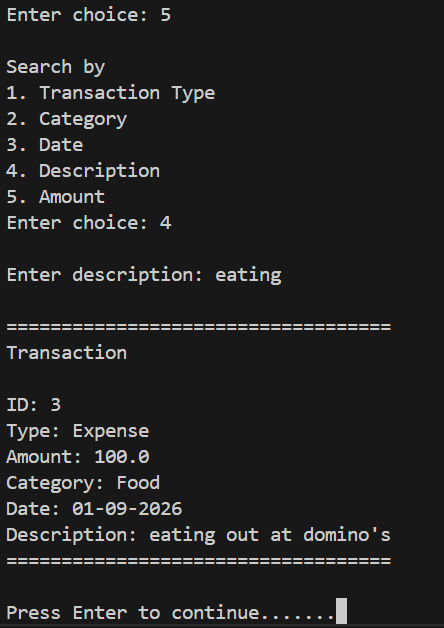

# Personal Finance Manager

A console-based Personal Finance Manager built with Python to help users record, manage, search, and analyze their income and expenses. The application uses object-oriented programming, CSV persistence, input validation, regular expressions, logging, and a modular project structure.

## Features

* Add income and expense transactions
* Automatically generate unique transaction IDs
* Display all stored transactions
* Update transactions by transaction ID
* Delete transactions by transaction ID
* Search transactions by:

  * Transaction type
  * Category
  * Date
  * Description
  * Amount
* Calculate:

  * Total income
  * Total expenses
  * Overall balance
* Generate expense summaries by category
* Find the highest expense
* Create, view, update, and delete budgets
* Check budget status and percentage used
* Generate monthly financial reports
* Generate category-based expenditure reports
* Save transactions to a CSV file
* Load previously saved transactions when the application starts
* Validate user input and transaction descriptions
* Record important application events using logging

## Technologies & Python Concepts

This project demonstrates:

* Python fundamentals
* Functions and modular programming
* Object-oriented programming (OOP)
* Classes and objects
* Dataclasses
* Class variables
* `__post_init__`
* `__str__`
* Lists and dictionaries
* Lambda functions
* Higher-order functions
* `match` / `case`
* List iteration
* CSV file handling
* `datetime`
* Exception handling
* Regular expressions (`re`)
* Logging
* Input validation
* File persistence
* Modular project organization
* Separation of models, services, utilities, and storage

## Screenshots

### Main Menu


### Transaction Management


### Budget Management


### Reports


### Searching Transactions


## Project Structure

personal-finance-manager-python/
│
├── main.py
│
├── models/
│   └── transaction.py
│
├── services/
│   ├── transaction_functions.py
│   ├── analytics.py
│   └── budget_management.py
│
├── storage/
│   └── csv_handler.py
│
├── utils/
│   └── input_helpers.py
│
├── data/
│   └── transactions.csv
│
├── images/
│   ├── main_menu.png
│   ├── adding_transaction.png
│   ├── budget_management.png
│   ├── reports.png
│   └── searching_options.png
│
├── finance_manager.log
│
├── .gitignore
│
└── README.md

## How It Works

### Transactions

Each transaction is represented by a `Transaction` dataclass containing:

* Transaction ID
* Transaction type
* Amount
* Category
* Date
* Description

Transaction IDs are generated automatically using a class-level counter. When transactions are loaded from the CSV file, their original IDs are restored and the next available ID is calculated from the highest existing ID.

This allows transaction IDs to remain consistent across application sessions.

### Transaction Types

The application supports two transaction types.

**Income**

* Salary
* Freelance
* Investments
* Gift
* Other

**Expense**

* Food
* Shopping
* Rent
* Bills
* Entertainment
* Transport
* Healthcare
* Education
* Other

### Searching

Transaction searching uses a reusable `DisplaySearchResults()` helper with lambda functions.

Different search conditions can be passed to the same helper instead of creating a separate search function for every transaction attribute.

Supported searches include:

* Transaction type
* Category
* Date
* Description
* Amount

### Budget Management

Users can:

* Set a budget
* View the current budget
* Update the budget
* Delete a budget
* Check whether spending is under, at, or over budget

The budget status also displays the amount remaining and the percentage of the budget used.

### Reports

The application provides two types of reports.

**Monthly Report**

Users select a month and year to view:

* Total income
* Total expenses
* Balance

**Category Expenditure Report**

Displays total expenses grouped by category.

## Data Persistence

Transactions are stored in:

```text
data/transactions.csv
```

The application uses Python's built-in `csv` module to:

* Write transactions to CSV
* Read transactions from CSV
* Restore transaction IDs
* Determine the next available transaction ID

This allows transaction data to persist between application sessions.

## Input Validation

The application validates user input to prevent invalid data from entering the system.

Examples include:

* Numeric input validation
* Positive amount validation
* Menu choice validation
* Budget-related validation
* Transaction description validation

Transaction descriptions are validated using a regular expression that allows letters, numbers, spaces, and common punctuation.

## Logging

The application uses Python's `logging` module to record important application events in:

```text
finance_manager.log
```

Examples of logged events include:

* Transactions loaded successfully
* Transactions added
* Transactions updated
* Transactions deleted
* Budgets created
* Budgets updated
* Budgets deleted
* Monthly reports generated
* Category-based reports generated
* Transactions saved
* Errors encountered while loading or saving transactions

Log entries include timestamps and log levels, making application activity easier to track.

## Error Handling

The application uses exception handling to handle common runtime problems such as:

* Invalid numeric input
* Invalid amounts
* Missing CSV files
* Errors while loading transactions
* Errors while saving transactions

The application provides user-friendly messages for common input errors instead of allowing them to terminate the program unexpectedly.

## How to Run

### 1. Clone the repository

```bash
git clone https://github.com/anshikadeo63/personal-finance-manager-python.git
```

### 2. Navigate into the project

```bash
cd personal-finance-manager-python
```

### 3. Run the application

```bash
python main.py
```

No external Python packages are required because the project uses Python's standard library.

## Example Workflow

```
Personal Finance Manager

1. Add Transaction
2. Display Transaction
3. Update Transaction
4. Delete Transaction
5. Search Transaction
6. Calculate Balance
7. Expense Summary
8. Highest Expense
9. Budgets
10. Reports
11. Exit
```

A typical workflow is:

1. Add income and expense transactions.
2. View or search transactions.
3. Update or delete transactions using their IDs.
4. Calculate the overall balance and review spending by category.
5. Create and manage a budget.
6. Generate monthly or category-based reports.
7. Exit the application and save transactions to CSV.
8. Restart the application and load the saved transactions.

## Future Improvements

Possible future improvements include:

* Automated unit tests
* More advanced financial analytics
* Improved report formatting
* More advanced transaction filtering
* Additional export formats
* Database-based persistence
* Graphical user interface

## Author

**Anshika Deo**

This project was developed as part of my Python learning journey to practice building a complete, modular application using Python fundamentals and progressively more advanced concepts.
